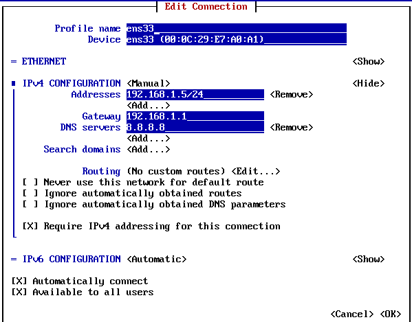
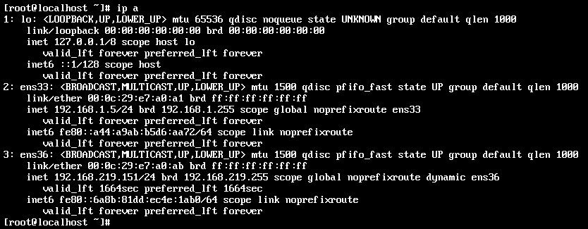
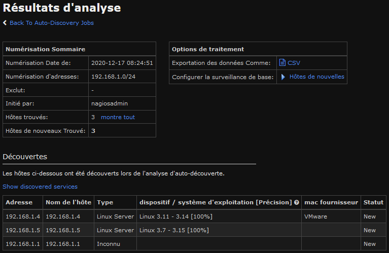
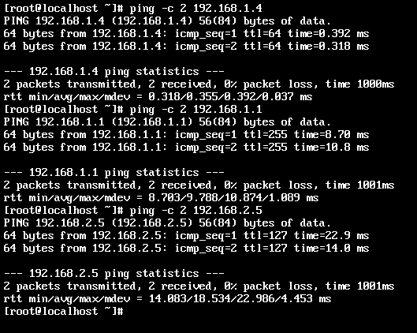
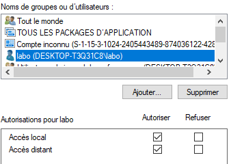
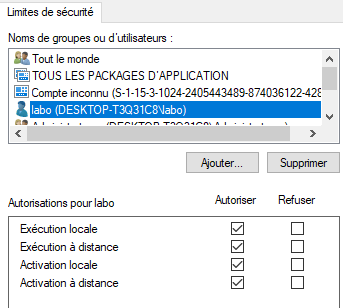
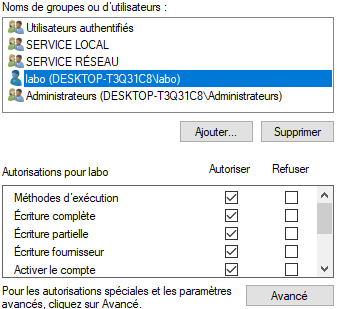
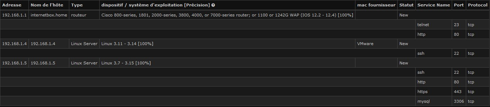
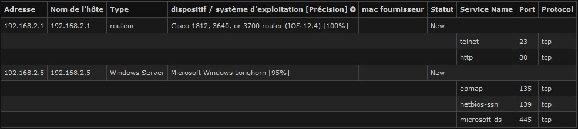

# Rapport GRX Labo 4

> Doran Kayoumi, Jérôme Arn

# Objectif 1 : Construire le réseau et réaliser la configuration de base des équipements.

> 4 Attribuez une adresse IP fixe à l’interface opérationnelle ens33.

````sh
# Avec la commande nmtui dans Edit a connection > ens33
nmtui
# puis après la configuration 
service network restart
````





> Les trois nœuds cibles sont « pingables » depuis la station Nagios

Dans l'interface web on peut déjà vérifier que NAGIOS reconnaît toutes les machines grâce à l'auto discovery. Pour le réseau **192.168.1.0/24**.




Et dans la capture ci-dessous on peut voir que l'on faire un ping sur le serveur ubuntu, le routeur et la machine WINB. 



# Objectif 2 : Configurer les nœuds cibles

## Routeur 

# TODO commentaires, une fois qu'on est sûr que les configurations fonctionnent

### SNMP + traps

````sh
no access-list 1 permit 192.168.1.3 # pour enlever la machine WinA de la liste d'accès au trap SNMP
access-list 1 permit 192.168.1.5 # Ajout de la machine Nagios à la liste d'accès 
````

### Syslog

````sh
no logging 192.168.1.3 # Enlever l'envoi syslog sur la machine Win A
logging 192.168.1.5 # envoi de syslog sur nagios
````

### Fichier de configuration résultant 

````
!
! Last configuration change at 09:31:55 UTC Sat Dec 19 2020
! NVRAM config last updated at 09:32:58 UTC Sat Dec 19 2020
!
version 12.4
service timestamps debug uptime
service timestamps log datetime msec
no service password-encryption
!
hostname router
!
boot-start-marker
boot-end-marker
!
!
no aaa new-model
memory-size iomem 5
ip cef
!
#....
!
interface FastEthernet0/0
 ip address 192.168.1.1 255.255.255.0
 duplex auto
 speed auto
!
interface FastEthernet0/1
 ip address 192.168.2.1 255.255.255.0
 duplex auto
 speed auto
!
interface FastEthernet1/0
 ip address dhcp
 duplex auto
 speed auto
!
interface FastEthernet2/0
 no ip address
 shutdown
 duplex auto
 speed auto
!
ip forward-protocol nd
!
ip http server
no ip http secure-server
!
logging 192.168.1.5
access-list 1 permit 192.168.1.5
snmp-server engineID local 123456789A
snmp-server user jerome GRX v3 
snmp-server group GRX v3 noauth access 1
snmp-server group GRX v3 priv access 1
snmp-server view ViewDefault iso included
snmp-server contact jerome.arn@heig-vd.ch
snmp-server enable traps snmp authentication linkdown linkup coldstart warmstart
snmp-server enable traps vrrp
#.... Liste de toutes les traps SNMP
!
!
!
control-plane
!
#....
!
line con 0
line aux 0
line vty 0 4
 login
!
ntp clock-period 17179872
ntp master 7
ntp server 46.165.252.57
ntp server 84.16.73.33
ntp server 5.148.175.134
ntp server 192.168.232.2
!
end
````


## Ubuntu SRV

### Syslog

Dans le fichier **/etc/ryslog.conf** nous avons modifié la dernière ligne pour la remplacer par celle-ci.

````sh
*.* @192.168.1.5 514 
````

## Windows 10 B

### WMI

Pour cette partie nous avons repris la même configuration que dans le laboratoire précédent pour la machine WINB. Dans l'application **Exécuter** lancer **DCOMCNFG**. Puis dans le menu `Racine de console  > Services de composants > Ordinateurs >  Poste de travail` faites un clique droit `Propriété` et allez sur l'onglet  `Sécurité COM` et ajouter l'utilisateur **labo** et lui ajouter toutes les autorisations.

| Autorisations d'accès  | Autorisations d'exécution et d'activation |
| ---------------------- | ----------------------------------------- |
|  |                     |

Dans l'application **Exécuter** lancer **wmimgmt.msc**. Puis dans le menu `Racine de la console > Contrôle WMI(local)`   faites un clique droit `Propriété` et allez dans l'onglet `Sécurité` et sélectionné **WMI** puis appuyer sur le bouton `Sécurité` et ajouter l'utilisateur **labo** et lui ajouter toutes les autorisations. Puis ensuite faites un redémarrage de la machine. 




# Objectif 3 : Auto découverte d’un réseau 

> Capturez le trafic (Wireshark) sur l’interface ens33 de gestion de votre VM Nagios.


> Découvrez la topologie de votre réseau à l’aide de la fonction d’auto-découverte.

Dans l'interface web on peut déjà vérifier que NAGIOS reconnaît toutes les machines grâce à l'auto discovery. Pour le réseau **192.168.1.0/24**.


Pour le réseau **192.168.2.0/24**.

> Pour chaque nœud découvert, montrez les caractéristiques découvertes par Nagios.

Pour le réseau **192.168.1.0/24**.



Pour le réseau **192.168.2.0/24**.



> A l’aide de la capture réalisée au point 7, expliquez la stratégie de découverte initiée par Nagios.


> A l’aide de l’attribut « parent », hiérarchisez la carte topologique Hypermap.


# Objectif 4 : Affinage de l’inventaire des nœuds cibles

