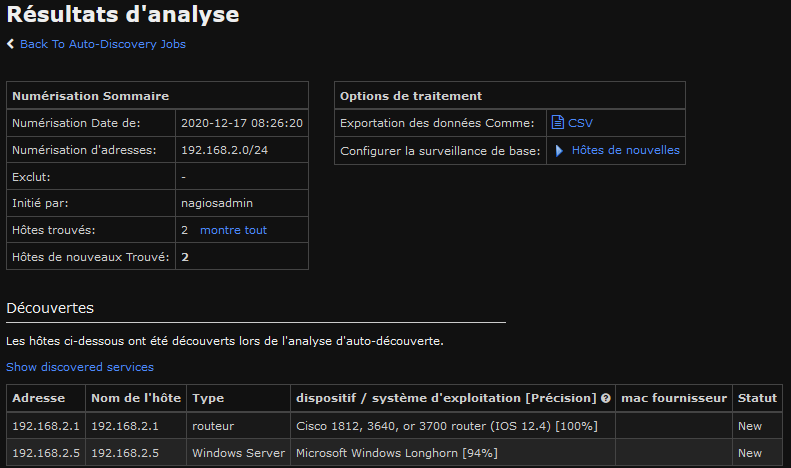
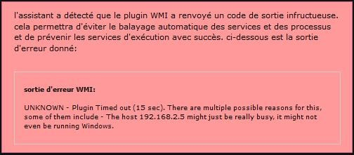
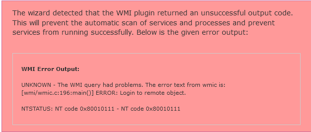
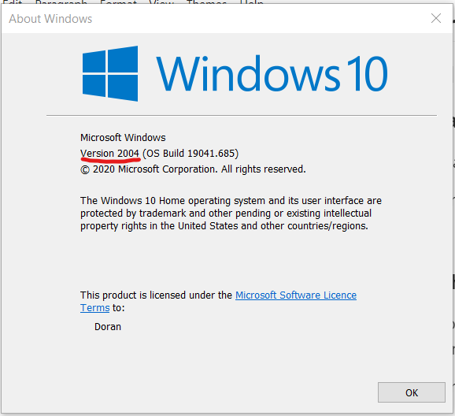
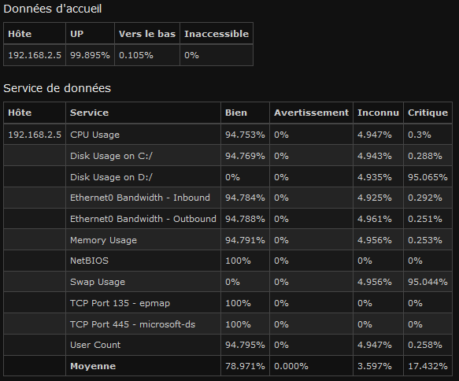

# Rapport GRX Labo 4

> Doran Kayoumi, Jérôme Arn

# Objectif 1 : Construire le réseau et réaliser la configuration de base des équipements.

> Attribuez une adresse IP fixe à l’interface opérationnelle ens33.

````sh
# Avec la commande nmtui dans Edit a connection > ens33
nmtui
# puis après la configuration 
service network restart
````


> Les trois nœuds cibles sont « pingables » depuis la station Nagios

Et dans la capture ci-dessous on peut voir que l'on faire un ping sur le serveur ubuntu, le routeur et la machine WINB. 


# Objectif 2 : Configurer les nœuds cibles

## Routeur 

### SNMP + traps

````sh
no access-list 1 permit 192.168.1.3 # pour enlever la machine WinA de la liste d'accès au trap SNMP
access-list 1 permit 192.168.1.5 # Ajout de la machine Nagios à la liste d'accès 
````

### Syslog

````sh
no logging 192.168.1.3 # Enlever l'envoi syslog sur la machine Win A
logging 192.168.1.5 # envoi de syslog sur nagios
````

### Fichier de configuration résultant 

Voir fichier en annexe.

## Ubuntu SRV

### Syslog

Dans le fichier **/etc/ryslog.conf** nous avons modifié la dernière ligne pour la remplacer par celle-ci.

````sh
*.* @192.168.1.5 514 
````

## Windows 10 B

### WMI

Pour cette partie nous avons repris la même configuration que dans le laboratoire précédent pour la machine WINB. Dans l'application **Exécuter** lancer **DCOMCNFG**. Puis dans le menu `Racine de console  > Services de composants > Ordinateurs >  Poste de travail` faites un clique droit `Propriété` et allez sur l'onglet  `Sécurité COM` et ajouter l'utilisateur **labo** et lui ajouter toutes les autorisations.

| Autorisations d'accès  | Autorisations d'exécution et d'activation |
| ---------------------- | ----------------------------------------- |
|  |                     |

Dans l'application **Exécuter** lancer **wmimgmt.msc**. Puis dans le menu `Racine de la console > Contrôle WMI(local)`   faites un clique droit `Propriété` et allez dans l'onglet `Sécurité` et sélectionné **WMI** puis appuyer sur le bouton `Sécurité` et ajouter l'utilisateur **labo** et lui ajouter toutes les autorisations. Puis ensuite faites un redémarrage de la machine. 


# Objectif 3 : Auto découverte d’un réseau 

> Découvrez la topologie de votre réseau à l’aide de la fonction d’auto-découverte.

Dans l'interface web on peut déjà vérifier que NAGIOS reconnaît toutes les machines grâce à l'auto discovery. Pour le réseau **192.168.1.0/24**.


Pour le réseau **192.168.2.0/24**.

> Pour chaque nœud découvert, montrez les caractéristiques découvertes par Nagios.

Pour le réseau **192.168.1.0/24**.


Pour le réseau **192.168.2.0/24**.


> A l’aide de la capture réalisée au point 7, expliquez la stratégie de découverte initiée par Nagios.

Tout d'abord NAGIOS effectue des requêtes ARP aléatoires sur toutes la plage d'adresse afin de voir les machines qui répondent.


Puis ensuite, avec des requêtes TCP SYN, NAGIOS teste les ports ouverts. en principe il teste les principaux ports.  


ensuite NAGIOS effectue plusieurs ping sur les machines découvertes sur différent port. Puis dans la finalité, NAGIOS regarde quel type de service fonctionne sur les différents port


> A l’aide de l’attribut « parent », hiérarchisez la carte topologique Hypermap.

En allant dans dans la partie Hypermap, on peut voir le graphe du réseau générer automatiquement. Pour le modifier, il faut cliquer dans l'onglet `configuration > reconfigurer cet hôte ` Puis dans l'onglet `acceuil - Les Parents`.


# Objectif 4 : Affinage de l’inventaire des nœuds cibles

## WinB

### WMI

#### Infrastructure virtualisée

Nous avons en premier lieu essayer avec l'infrastructure virtualisée, mais nous obtenions une erreur lié a un timeout.

Erreur:



#### Machine hôte

Sur conseil de M. Bron, nous avons donc essayé d'effectuer cette manipulation sur notre machine hôte. Après configuration de WMI sur notre machine hôte, nous obtenons une nouvelle erreur qui indique cette fois une erreur de connection.

Erreur:



Après investigation, nous sommes tombés sur plusieurs post/forum ou des personnes avaient le même problème que nous. Le problème serait lié à une version de Windows (Windows 10 2004) qui aurait "cassé" WMIC qui est utilisé par Nagios. En vérifiant la version de Windows que nous utilisons, nous avons  constaté que nous utilisons Windows 10 2004, qui est la version  problématique.



Source:

* https://edcint.co.nz/checkwmiplus/forums/topic/wmic-stopped-working-on-windows-10-build-2004/
* https://www.windowsphoneinfo.com/threads/wmic-stopped-working-on-windows-10-2004.454468/

Nous n'avons donc pas pu effectué cetter manipulation.

### NCPA

Une fois l'agent NCPA installé sur la machine Windows B, on peut voir dans l'onglet ``Rapports` les valeurs des différents services surveiller.



## Routeur

### SNMP

Avec le plugin SNMP Walk on peut avoir les valeurs des objets SNMP et déclarer des alertes en cas de dépassement de seuil. On peut choisir quelles OID veut monitorer avec les niveaux de seuils. 


Et ensuite on peut voir les notifications dans l'onglet Rapports **Rapports disponibles > Notifications** en occurrence nous avons des alertes critiques car nous comparons les même string.


### Network Switch/routers

Pour monitorer les interfaces du routeur, nous utilisons le plugin **commutateur réseau/ routeur**. Puis nous sélectionnons les interfaces voulues avec les seuils pour chaque interface


## Ubuntu Server

### Syslog

Dans l'onglet **Configurer > Gestionnaire de configuration de base  > commandes** créer une commande afin d'exécuter la commande suivante :

````sh
/usr/local/nrdp/plugins/Generic/check_log -F /var/log/messages -0 /var/log/messages_ubuntu -q "ubuntulabs "
````

Puis dans **Configurer > Gestionnaire de configuration de base  > services ** créer un service qui va exécuter régulièrement cette commande. et on peut voir que le **service syslogs** apparaît dans les notifications.


Mais malheureusement je n'ai pas réussi à faire en sorte que l'on voie les logs de manières détaillées. Sauf en faisant la commande dans le terminal.


## Dashboard

Voilà la vue de quelques unes de nos machine après avoir "tuner" notre tableau de bords.


