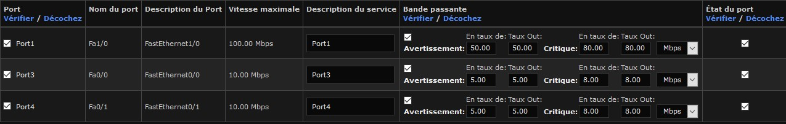

# Rapport GRX Labo 4

> Doran Kayoumi, Jérôme Arn

# Objectif 1 : Construire le réseau et réaliser la configuration de base des équipements.

> 4 Attribuez une adresse IP fixe à l’interface opérationnelle ens33.

````sh
# Avec la commande nmtui dans Edit a connection > ens33
nmtui
# puis après la configuration 
service network restart
````


> Les trois nœuds cibles sont « pingables » depuis la station Nagios

Dans l'interface web on peut déjà vérifier que NAGIOS reconnaît toutes les machines grâce à l'auto discovery. Pour le réseau **192.168.1.0/24**.


Et dans la capture ci-dessous on peut voir que l'on faire un ping sur le serveur ubuntu, le routeur et la machine WINB. 


# Objectif 2 : Configurer les nœuds cibles

## Routeur 

# TODO commentaires, une fois qu'on est sûr que les configurations fonctionnent

### SNMP + traps

````sh
no access-list 1 permit 192.168.1.3 # pour enlever la machine WinA de la liste d'accès au trap SNMP
access-list 1 permit 192.168.1.5 # Ajout de la machine Nagios à la liste d'accès 
````

### Syslog

````sh
no logging 192.168.1.3 # Enlever l'envoi syslog sur la machine Win A
logging 192.168.1.5 # envoi de syslog sur nagios
````

### Fichier de configuration résultant 

````
!
! Last configuration change at 09:31:55 UTC Sat Dec 19 2020
! NVRAM config last updated at 09:32:58 UTC Sat Dec 19 2020
!
version 12.4
service timestamps debug uptime
service timestamps log datetime msec
no service password-encryption
!
hostname router
!
boot-start-marker
boot-end-marker
!
!
no aaa new-model
memory-size iomem 5
ip cef
!
#....
!
interface FastEthernet0/0
 ip address 192.168.1.1 255.255.255.0
 duplex auto
 speed auto
!
interface FastEthernet0/1
 ip address 192.168.2.1 255.255.255.0
 duplex auto
 speed auto
!
interface FastEthernet1/0
 ip address dhcp
 duplex auto
 speed auto
!
interface FastEthernet2/0
 no ip address
 shutdown
 duplex auto
 speed auto
!
ip forward-protocol nd
!
ip http server
no ip http secure-server
!
logging 192.168.1.5
access-list 1 permit 192.168.1.5
snmp-server engineID local 123456789A
snmp-server user jerome GRX v3 
snmp-server group GRX v3 noauth access
!
! Last configuration change at 20:46:44 UTC Tue Dec 29 2020
! NVRAM config last updated at 20:48:52 UTC Tue Dec 29 2020
!
version 12.4
service timestamps debug uptime
service timestamps log datetime msec
no service password-encryption
!
hostname router
!
boot-start-marker
boot-end-marker
!
!
no aaa new-model
memory-size iomem 5
ip cef
!
!
interface FastEthernet0/0
 ip address 192.168.1.1 255.255.255.0
 duplex auto
 speed auto
!
interface FastEthernet0/1
 ip address 192.168.2.1 255.255.255.0
 duplex auto
 speed auto
!
interface FastEthernet1/0
 ip address dhcp
 duplex auto
 speed auto
!
interface FastEthernet2/0
 no ip address
 shutdown
 duplex auto
 speed auto
!
ip forward-protocol nd
!
ip http server
no ip http secure-server
!
logging 192.168.1.5
access-list 1 permit 192.168.1.5
snmp-server engineID local 123456789A
snmp-server view ViewDefault iso included
snmp-server community cisco RO
snmp-server community ciscorw RW
snmp-server contact jerome.arn@heig-vd.ch
snmp-server enable traps snmp authentication linkdown linkup coldstart warmstart
snmp-server enable traps vrrp
snmp-server enable traps ds1
snmp-server enable traps tty
snmp-server enable traps eigrp
snmp-server enable traps xgcp
snmp-server enable traps flash insertion removal
snmp-server enable traps ds3
snmp-server enable traps envmon
snmp-server enable traps icsudsu
snmp-server enable traps isdn call-information
snmp-server enable traps isdn layer2
snmp-server enable traps isdn chan-not-avail
snmp-server enable traps isdn ietf
snmp-server enable traps ds0-busyout
snmp-server enable traps ds1-loopback
snmp-server enable traps atm subif
snmp-server enable traps cnpd
snmp-server enable traps config-copy
snmp-server enable traps config
snmp-server enable traps dial
snmp-server enable traps dsp card-status
snmp-server enable traps entity
snmp-server enable traps event-manager
snmp-server enable traps frame-relay
snmp-server enable traps frame-relay subif
snmp-server enable traps hsrp
snmp-server enable traps ipmobile
snmp-server enable traps ipmulticast
snmp-server enable traps msdp
snmp-server enable traps mvpn
snmp-server enable traps ospf state-change
snmp-server enable traps ospf errors
snmp-server enable traps ospf retransmit
snmp-server enable traps ospf lsa
snmp-server enable traps ospf cisco-specific state-change nssa-trans-change
snmp-server enable traps ospf cisco-specific state-change shamlink interface-old
snmp-server enable traps ospf cisco-specific state-change shamlink neighbor
snmp-server enable traps ospf cisco-specific errors
snmp-server enable traps ospf cisco-specific retransmit
snmp-server enable traps ospf cisco-specific lsa
snmp-server enable traps pim neighbor-change rp-mapping-change invalid-pim-message
snmp-server enable traps pppoe
snmp-server enable traps cpu threshold
snmp-server enable traps rsvp
snmp-server enable traps rtr
snmp-server enable traps syslog
snmp-server enable traps l2tun session
snmp-server enable traps vtp
snmp-server enable traps voice poor-qov
snmp-server enable traps voice fallback
snmp-server enable traps dnis
snmp-server host 192.168.1.5 version 2c public 
!
!
control-plane
!
!
line con 0
line aux 0
line vty 0 4
 login
!
ntp clock-period 17179880
ntp master 7
ntp server 46.165.252.57
ntp server 84.16.73.33
ntp server 5.148.175.134
ntp server 192.168.232.2
!
end
 1
snmp-server group GRX v3 priv access 1
snmp-server view ViewDefault iso included
snmp-server contact jerome.arn@heig-vd.ch
snmp-server enable traps snmp authentication linkdown linkup coldstart warmstart
snmp-server enable traps vrrp
#.... Liste de toutes les traps SNMP
!
!
!
control-plane
!
#....
!
line con 0
line aux 0
line vty 0 4
 login
!
ntp clock-period 17179872
ntp master 7
ntp server 46.165.252.57
ntp server 84.16.73.33
ntp server 5.148.175.134
ntp server 192.168.232.2
!
end
````

## Ubuntu SRV

### Syslog

Dans le fichier **/etc/ryslog.conf** nous avons modifié la dernière ligne pour la remplacer par celle-ci.

````sh
*.* @192.168.1.5 514 
````

## Windows 10 B

### WMI

Pour cette partie nous avons repris la même configuration que dans le laboratoire précédent pour la machine WINB. Dans l'application **Exécuter** lancer **DCOMCNFG**. Puis dans le menu `Racine de console  > Services de composants > Ordinateurs >  Poste de travail` faites un clique droit `Propriété` et allez sur l'onglet  `Sécurité COM` et ajouter l'utilisateur **labo** et lui ajouter toutes les autorisations.

| Autorisations d'accès  | Autorisations d'exécution et d'activation |
| ---------------------- | ----------------------------------------- |
|  |                     |

Dans l'application **Exécuter** lancer **wmimgmt.msc**. Puis dans le menu `Racine de la console > Contrôle WMI(local)`   faites un clique droit `Propriété` et allez dans l'onglet `Sécurité` et sélectionné **WMI** puis appuyer sur le bouton `Sécurité` et ajouter l'utilisateur **labo** et lui ajouter toutes les autorisations. Puis ensuite faites un redémarrage de la machine. 


# Objectif 3 : Auto découverte d’un réseau 

> Découvrez la topologie de votre réseau à l’aide de la fonction d’auto-découverte.

Dans l'interface web on peut déjà vérifier que NAGIOS reconnaît toutes les machines grâce à l'auto discovery. Pour le réseau **192.168.1.0/24**.


Pour le réseau **192.168.2.0/24**.

> Pour chaque nœud découvert, montrez les caractéristiques découvertes par Nagios.

Pour le réseau **192.168.1.0/24**.


Pour le réseau **192.168.2.0/24**.


> A l’aide de la capture réalisée au point 7, expliquez la stratégie de découverte initiée par Nagios.

Tout d'abord NAGIOS effectue des requêtes ARP aléatoires sur toutes la plage d'adresse afin de voir les machines qui répondent.


Puis ensuite, avec des requêtes TCP SYN, NAGIOS teste les ports ouverts. en principe il teste les principaux ports.  


ensuite NAGIOS effectue plusieurs ping sur les machines découvertes sur différent port. Puis dans la finalité, NAGIOS regarde quel type de service fonctionne sur les différents port


> A l’aide de l’attribut « parent », hiérarchisez la carte topologique Hypermap.

En allant dans dans la partie Hypermap, on peut voir le graphe du réseau générer automatiquement. Pour le modifier, il faut cliquer dans l'onglet `configuration > reconfigurer cet hôte ` Puis dans l'onglet `acceuil - Les Parents`.


# Objectif 4 : Affinage de l’inventaire des nœuds cibles

## WinB

### WMI

Malheureusement nous n'arrivons pas à faire fonctionner le plugin WMI sur la machine Windows B. Sur conseil de M.Bron, nous faisons cette manipulations sur notre machine hôte. 

### NCPA

Une fois l'agent NCPA installé sur la machine Windows B, on peut voir dans l'onglet ``Rapports` les valeurs des différents services surveiller.


## Routeur

### SNMP

Avec le plugin SNMP Walk on peut avoir les valeurs des objets SNMP et déclarer des alertes en cas de dépassement de seuil. On peut choisir quelles OID veut monitorer avec les niveaux de seuils. 


Et ensuite on peut voir les notifications dans l'onglet Rapports **Rapports disponibles > Notifications** en occurrence nous avons des alertes critiques car nous comparons les même string.


### Network Switch/routers

Pour monitorer les interfaces du routeur, nous utilisons le plugin **commutateur réseau/ routeur**. Puis nous sélectionnons les interfaces voulues avec les seuils pour chaque interface



## Ubuntu Server

### Syslog

Dans l'onglet **Configurer > Gestionnaire de configuration de base  > commandes** créer une commande afin d'exécuter la commande suivante :

````sh
/usr/local/nrdp/plugins/Generic/check_log -F /var/log/messages -0 /var/log/messages_ubuntu -q "ubuntulabs "
````

Puis dans **Configurer > Gestionnaire de configuration de base  > services ** créer un service qui va exécuter régulièrement cette commande. et on peut voir que le **service syslogs** apparaît dans les notifications.


Mais malheureusement je n'ai pas réussi à faire en sorte que l'on voie les logs de manières détaillées. Sauf en faisant la commande dans le terminal.


## Dashboard

Voilà la vue de quelques unes de nos machine après avoir "tuner" notre tableau de bords.


